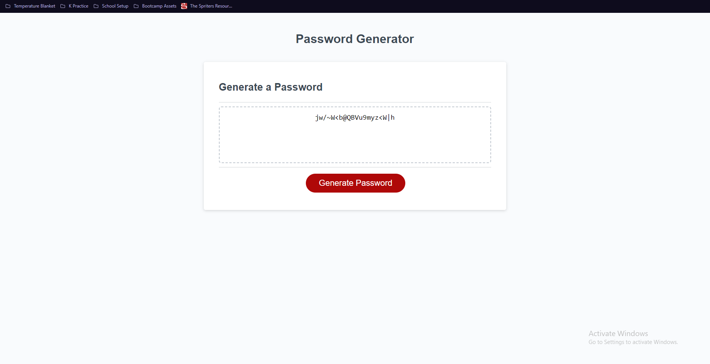

# Password Generator Challenge

## Description

This web application features a unique password generator using Javascript. Through this application users are able to generate a unique password. This provides a strong password that is not easy to guess improving security to personal data. The application receives user input through message prompts allowing for the user to select different criteria for their password. These criterias being password standards of uppercase, lowercase, numeric, and special character values as well as the ability to choose password length. Through this challenge I was able to familiarize myself with Javascript as a whole, including its functions as well as creating arrays that can be used for random selection among other things.

## Installation

N/A

## Usage

Images below provide a snapshot of webpage including functionality.

## Credits

Rutger University: https://git.bootcampcontent.com/Rutgers-University/RUT-VIRT-FSF-FT-02-2023-U-LOLC

## License

MIT License

Copyright (c) [2023] [Matos,Natalie]

Permission is hereby granted, free of charge, to any person obtaining a copy
of this software and associated documentation files (the "Software"), to deal
in the Software without restriction, including without limitation the rights
to use, copy, modify, merge, publish, distribute, sublicense, and/or sell
copies of the Software, and to permit persons to whom the Software is
furnished to do so, subject to the following conditions:

The above copyright notice and this permission notice shall be included in all
copies or substantial portions of the Software.

THE SOFTWARE IS PROVIDED "AS IS", WITHOUT WARRANTY OF ANY KIND, EXPRESS OR
IMPLIED, INCLUDING BUT NOT LIMITED TO THE WARRANTIES OF MERCHANTABILITY,
FITNESS FOR A PARTICULAR PURPOSE AND NONINFRINGEMENT. IN NO EVENT SHALL THE
AUTHORS OR COPYRIGHT HOLDERS BE LIABLE FOR ANY CLAIM, DAMAGES OR OTHER
LIABILITY, WHETHER IN AN ACTION OF CONTRACT, TORT OR OTHERWISE, ARISING FROM,
OUT OF OR IN CONNECTION WITH THE SOFTWARE OR THE USE OR OTHER DEALINGS IN THE
SOFTWARE.